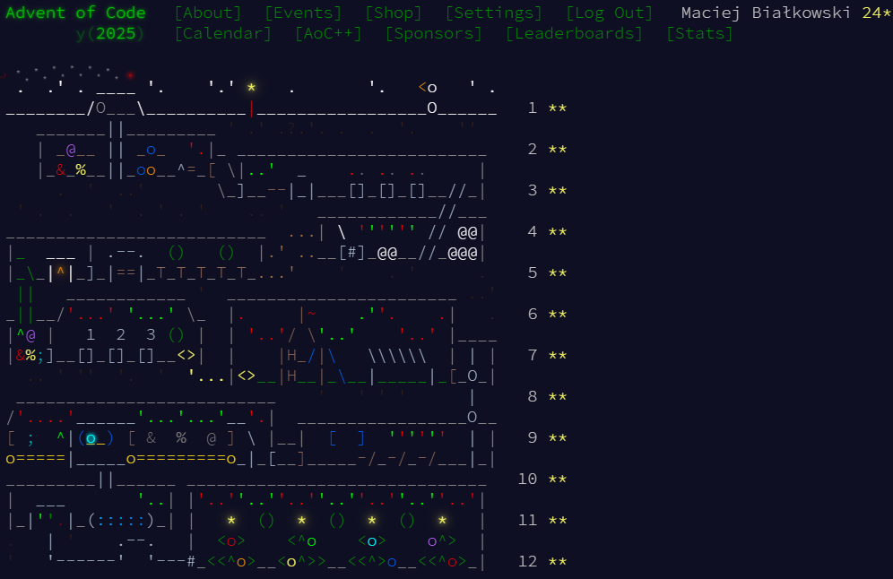

# Advent of code 2025
I encourage everyone to take a look at the [Advent of Code 2025](https://adventofcode.com/2025) event! It's a fun way to challenge your programming skills with daily coding puzzles throughout December.

If you are blocked on a puzzle, feel free to check out my solutions in this repository. I have provided my implementations for each day's challenge, which you can use as a reference or inspiration.

